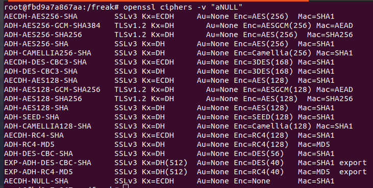
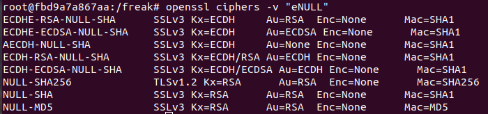
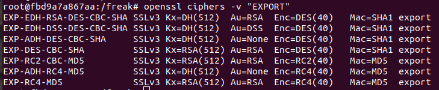
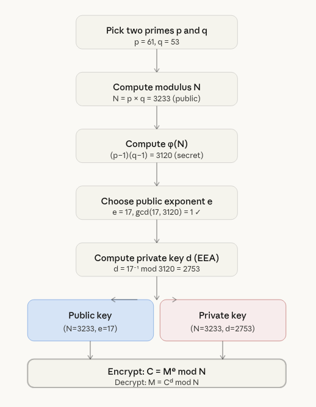
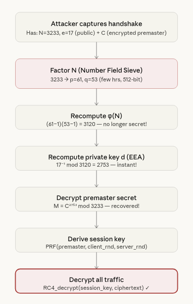

## The Ciphersuites List
Run `openssl ciphers -v`. This shows the default cipherlist. The default cipherlist uses the following filter for its ciphersuites -

```
DEFAULT = HIGH:MEDIUM:!aNULL:!eNULL:!EXPORT:!DES:!RC4:!MD5:!PSK:!SRP:!CAMELLIA
``` 

The filters defined as part of the default list are - 
1. `HIGH` - ciphersuites with key length > 128 bits during symmetric encryption.
2. `MEDIUM` - ciphersuites with key length = 128 bits during symmetric encryption.
3. `!aNULL` - The default list doesn't include ciphersuites that do not perform server authentication. 
4. `!eNULL` - The default list doesn't include ciphersuites that do not encrypt data at all. 
5. `!EXPORT` - ciphersuites that are not export-grade.
6. `!DES, !RC4` - ciphersuites that don't use RC4 and DES

and so on ...

<details>
  <summary> Ciphersuites with no authentication. </summary>
    <figure>
        
    </figure>
</details>

<details>
  <summary> Ciphersuites with no encryption. </summary>
    <figure>
        
    </figure>
</details>

<details>
  <summary> Export-grade ciphersuites. </summary>
    <figure>
        
    </figure>
</details>

## Export-grade ciphersuites
The US government introduced them, specifically through export regulations called the Export Administration Regulations (EAR) in the 1990s. The US government at the time classified strong cryptography as a munition — in the same category as weapons. Exporting it outside the US was restricted for national security reasons. The reasoning was:
> "We want foreign countries to be able to use encryption for commerce, but we want to ensure our intelligence agencies (NSA) can still break it if needed."

So a compromise was reached — software could be exported only if the encryption was deliberately weakened to:
- 512-bit RSA for key exchange
- 40-bit symmetric encryption

US companies like Netscape, Microsoft, RSA Security — all had to ship deliberately crippled versions of their software for international markets. This is why these cipher suites were baked into SSL/TLS specifications of that era.


**What went wrong long term?**

- The regulations were lifted in 1999 — strong crypto could be exported freely
- But the export cipher suites were never removed from implementations
- They just sat there, dormant, for 15+ years
- Until researchers discovered in 2015 that millions of servers still accepted them

So FREAK is essentially the ghost of 1990s US crypto policy coming back to haunt the internet in 2015. The vulnerability wasn't a programming mistake — it was a deliberate policy decision whose consequences outlived the policy itself by decades.

<details>
  <summary> Export-grade ciphersuites. </summary>
    <figure>
        
    </figure>
</details>

| Cipher Suite | Protocol | Key Exchange | Authentication | Encryption | MAC | Grade |
|---|---|---|---|---|---|---|
| EXP-EDH-RSA-DES-CBC-SHA | SSLv3 | DH (512-bit) | RSA | DES (40-bit) | SHA1 | Export |
| EXP-EDH-DSS-DES-CBC-SHA | SSLv3 | DH (512-bit) | DSS | DES (40-bit) | SHA1 | Export |
| EXP-ADH-DES-CBC-SHA | SSLv3 | DH (512-bit) | None | DES (40-bit) | SHA1 | Export |
| EXP-DES-CBC-SHA | SSLv3 | RSA (512-bit) | RSA | DES (40-bit) | SHA1 | Export |
| EXP-RC2-CBC-MD5 | SSLv3 | RSA (512-bit) | RSA | RC2 (40-bit) | MD5 | Export |
| EXP-ADH-RC4-MD5 | SSLv3 | DH (512-bit) | None | RC4 (40-bit) | MD5 | Export |
| EXP-RC4-MD5 | SSLv3 | RSA (512-bit) | RSA | RC4 (40-bit) | MD5 | Export |

A couple of interesting observations:
- `EXP-ADH-*` ciphers have `Au=None` — so they are **doubly dangerous**, weak key exchange AND no authentication
- All symmetric encryption is either **DES(40)** or **RC4(40)** or **RC2(40)** — all 40-bit, all trivially brute forceable
- Export grade cipher suites were originally introduced in SSLv3. Note that these can still be negotiated with newer TLS versions like TLSv1.2, unless both the client and server are safeguarded from using weak export-grade cipher suites.

## RSA Key Generation

<details>
  <summary> RSA Key Generation Algorithm </summary>

  **Step 1 — Pick two large primes p and q:**
```
p = 61, q = 53   (tiny example for illustration)
```

**Step 2 — Compute N:**
```
N = p × q = 61 × 53 = 3233
```
N is the **modulus** — it's public.

**Step 3 — Compute Euler's totient φ(N):**
```
φ(N) = (p-1) × (q-1) = 60 × 52 = 3120
```
This is kept **secret** — it depends on knowing p and q.

**Step 4 — Choose public exponent e:**
```
e = 17
```
e must satisfy:
- 1 < e < φ(N)
- gcd(e, φ(N)) = 1  (e and φ(N) are coprime)

**Step 5 — Compute private exponent d:**
```
d = e⁻¹ mod φ(N)
d = 17⁻¹ mod 3120 = 2753
```
This means `d × e ≡ 1 mod φ(N)` — d is the **modular inverse** of e.
Computed efficiently using the Extended Euclidean Algorithm.

**Final keys:**
```
Public key:  (N=3233, e=17)   ← shared openly
Private key: (N=3233, d=2753) ← kept secret
```

---

## RSA Encryption and Decryption

**Encryption** (client encrypts premaster secret M with server's public key):
```
C = Mᵉ mod N
```

**Decryption** (server decrypts with private key):
```
M = Cᵈ mod N
```

---
  
  

</details>


## Math behind FREAK Attack

<details>
  <summary> The FREAK Attack - Breaking RSA </summary>

**What the attacker has:**
- N and e from the server's public key (both public)
- C — the encrypted premaster secret (captured from the handshake)

**Step 1 — Factor N:**
```
N = 3233
→ find p and q such that p × q = 3233
→ p = 61, q = 53
```
For 512-bit N this takes a few hours using Number Field Sieve algorithm.

**Step 2 — Recompute φ(N):**
```
φ(N) = (p-1) × (q-1) = 60 × 52 = 3120
```
Now attacker knows φ(N) which was supposed to be secret!

**Step 3 — Recompute private exponent d:**
```
d = e⁻¹ mod φ(N) = 17⁻¹ mod 3120 = 2753
```
 Computed efficiently using the Extended Euclidean Algorithm.

**Step 4 — Decrypt the premaster secret:**
```
M = Cᵈ mod N
```
Attacker now has the **premaster secret** M.

**Step 5 — Derive session key:**

Both client and server derive the session key from the premaster secret using a **PRF (Pseudo Random Function)**:
```
session_key = PRF(premaster_secret, "master secret", client_random + server_random)
```
The `client_random` and `server_random` are exchanged in plaintext during the handshake — so the attacker has all the inputs needed to compute the session key.

**Step 6 — Decrypt all traffic:**
```
plaintext = RC4_decrypt(session_key, ciphertext)
```
Everything is now decrypted. ✅

---



</details>


## Why 2048-bit RSA is Safe

The entire attack hinges on **Step 1 — factoring N**. For:
- **512-bit N** → factoring takes a few hours on a modern PC ❌
- **1024-bit N** → factoring takes years on a supercomputer ⚠️
- **2048-bit N** → factoring is computationally infeasible with current technology ✅

The math is identical — the only difference is the size of N. This is why key size matters so much in RSA.

## Normal Scenario

**For running the server**
- Build the docker image: `docker build -t freak-demo .` This is a one-time operation.
- Run the server container: `docker run -it -p 4433:4433 freak-demo`
- Run the TLS testing server.
```sh
openssl s_server \
  -key /freak/server_key.pem \
  -cert /freak/server_cert.pem \
  -cipher 'HIGH:EXPORT' \
  -serverpref \
  -tls1_2 \
  -accept 443
```

**For running the client**
- Build the docker image: `docker build -t freak-demo .` This is a one-time operation.
- Run the client container: `docker run -it freak-demo`
- Run the TLS testing client.
```sh
openssl s_client \
  -connect <server-ip>:443 \
  -cipher 'HIGH:EXPORT'
  -tls1_2
```

## FREAK vulnerability in a nutshell

**Server side:**

- Server had export cipher code sitting dormant from the 1990s
- It was never explicitly enabled, but also never explicitly removed
- When a ClientHello arrived offering only export ciphers, the server just... complied
- It should have said "I don't support export ciphers anymore" but it didn't

This server is configured with only strong ciphers — HIGH grade only. It has no idea export ciphers even exist. Yet watch what happens when the attacker manipulates the ClientHello...

**Client side:**

- Client never intended to use export ciphers
- It offered strong ciphers in its ClientHello
- When ServerHello came back with an export cipher, it should have said "I never offered that!"
- But it just... accepted it without checking

## Attacker Setup

On the attacker machine, we must run this command. Any traffic from the client is going to flow via the attacker machine (because the client connects to attacker's wifi hotspot, or via other means, such as ARP spoofing). The following command says - "If any TCP packet comes to attacker's system that is destined to port 4433, then instead of forwarding it, send it to NFQUEUE 0". Our attacker scapy script listens to this queue for incoming packets, and will modify the ClientHello message before forwarding it to server.

> NOTE - NFQUEUE (Netfilter Queue) is a feature in the Linux networking stack that allows packets to be passed from the kernel to user-space programs for inspection, modification, or decision-making.

`iptables -I FORWARD -p tcp --dst <SERVER_IP> --dport 4433 -j NFQUEUE --queue-num 0`

> NOTE - It is important to run `iptables -D FORWARD -p tcp --dst <SERVER_IP> --dport 4433 -j NFQUEUE --queue-num 0` on the attacker machine once you are done with the experiment. This deletes the entry from the forwarding iptable.


```
| Part | Meaning |
|---|---|
| `iptables` | The Linux firewall/packet filtering tool |
| `-I FORWARD` | **Insert** a rule into the **FORWARD** chain |
| `-p tcp` | Match only **TCP** packets |
| `--dport 4433` | Match only packets destined for **port 4433** |
| `-j NFQUEUE` | **Jump** to the NFQUEUE target (hand packet to userspace) |
| `--queue-num 0` | Send to queue number **0** (our script listens on this queue) |

**The FORWARD chain** is the key part — it handles packets that are **passing through** the machine, not destined for it. Since the attacker is a gateway/router:
```
Client → [attacker machine] → Server
              ↑
         FORWARD chain
         sees this traffic
```

If the traffic were destined for the attacker machine itself, it would go through the `INPUT` chain instead. But since we're routing client→server traffic, it goes through `FORWARD`.

**The NFQUEUE target** is what connects iptables to our Python script:
```
Packet arrives → iptables FORWARD chain → NFQUEUE → our script
                                                         ↓
                                                   inspect/modify
                                                         ↓
                                                   packet.accept()
                                                         ↓
                                                   forwarded to server

## Attacker Scapy Script High Level Idea
1. Listen on NFQUEUE
Sit and wait for packets to arrive from iptables. Every packet that matches our iptables rule gets handed to our script.
2. For each packet, ask: is this a TLS ClientHello?
Not every TCP packet on port 4433 is a ClientHello — there are ACKs, data packets, etc. We only care about the one packet that contains the ClientHello. Everything else should be forwarded untouched.
3. If it is a ClientHello, parse it
Navigate through the raw bytes to find where the cipher suite list starts. As we discussed, this requires skipping the TLS header, handshake header, client version, client random, and session ID.
4. Modify the cipher suite list
Replace whatever ciphers the client offered with just EXP-RC4-MD5.
5. Fix the length fields
Since we changed the size of the cipher list, update the TLS record length and handshake length fields accordingly.
6. Fix TCP and IP checksums
Recalculate checksums since we modified the payload.
7. Forward the modified packet
Call packet.accept() to send it on its way to the server.